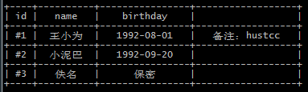

# word-table

> **word-table** is a simple javascript (browserjs / nodejs) library for drawing ascii tables in the `terminal` / `console`. Based on [word-width](https://github.com/hustcc/word-width).


[](https://travis-ci.org/hustcc/word-table) [](https://coveralls.io/github/hustcc/word-table?branch=master) [](https://www.npmjs.com/package/word-table) [](https://www.npmjs.com/package/word-table) [](https://www.npmjs.com/package/word-table)





# 1. Install & Import

> **npm install word-table**


 - Import it with `script` tag in HTML.

```js
<script type="text/javascript" src="dist/word-table.min.js"></script>
```

 - Import it with `require`.

```js
var WordTable = require('word-table');
//or
import WordTable from 'word-table';
```


# 2. Usage & API

See a demo firstly:

```js
var header = ['id', 'name', 'birthday'];
var body = [
  ['#1', '王小为', '1992-08-01', '备注：hustcc'], 
  ['#2', '小泥巴', '1992-09-20'],
  ['#3', '佚名', '保密']
];

// basic usage
var wt = new WordTable(header, body);
console.log(wt.string());
```

The API is so simple that documents are not needed.

```js
wt.setHeader(['id', 'name', 'birthday']);
wt.appendBody(['#3', '佚名', '保密']);
wt.setBody([['#4', '在线工具', '保密', 'atool.org']]);
wt.array();
wt.string();
wt.reset();
```

Detail usage and demo code, can see [here](tests/test.js), and run `npm test` can see the output.

The api are all chainable method, e.g.

```js
var wt = new WordTable();
wt.reset()
  .setHeader(['id', 'name', 'birthday'])
  .appendBody(['#3', '佚名', '保密']);
var str = wt.string();
```


# 3. Test

> npm install
>
> npm run build
> 
> npm test

Or you can open the [website](http://git.hust.cc/word-table/), then test it in `Console [F12]`.


# 4. LICENSE

MIT@[hustcc](https://github.com/hustcc).

